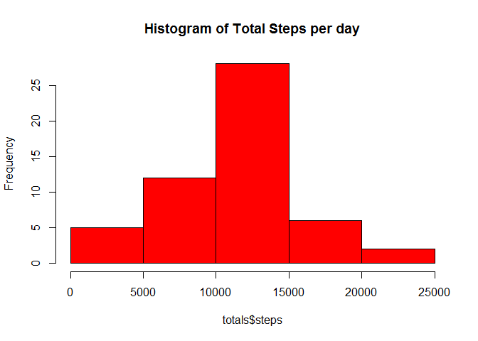
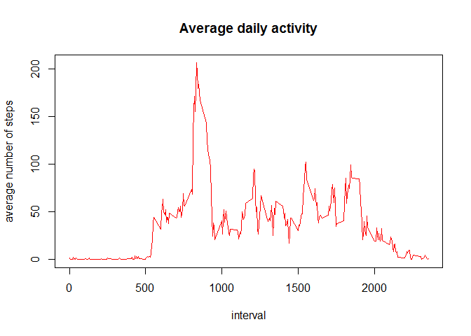
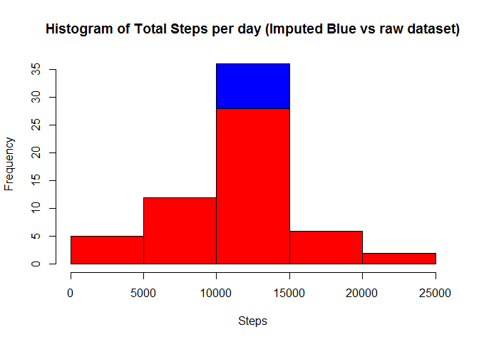
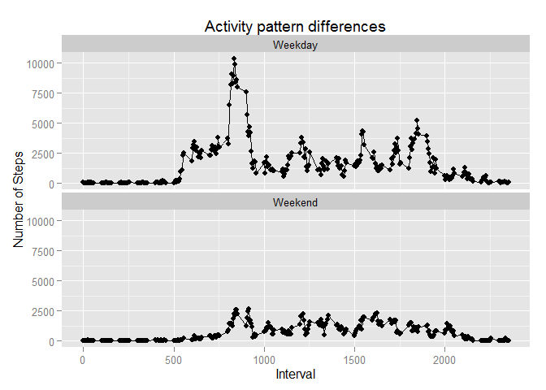

# Reproducible Research: Peer Assessment 1


## Loading and preprocessing the data
Unzip the dataset zip files if not yet exists

```r
    if(!file_test("-f","activity.csv"))
    {
        unzip(zipfile = "activity.zip")
    }
```
Read dataset

```r
    ds<-read.csv("activity.csv")
```

## What is mean total number of steps taken per day?


```r
    totals=aggregate(steps ~ date,ds , sum, na.rm=TRUE)
    hist(totals$steps,main = "Histogram of Total Steps per day", col = "red")
```

 

Calculate mean and median values


```r
    meanVal=mean(totals$steps)  
    medianVal=median(totals$steps)
```
The **mean** of the Total Steps per day is **1.0766189\times 10^{4}**  
The **median** of the Total Steps per day is **10765**  

## What is the average daily activity pattern?  

```r
    meansPerInterval=aggregate(steps ~ interval,ds,FUN=mean, na.rm=TRUE)
    
    plot(meansPerInterval$interval,meansPerInterval$steps,type='l',
         main="Average daily activity",
         ylab = "average number of steps",xlab="interval",col="red")
```

 

Which 5-minute interval, on average across all the days in the dataset, contains the maximum number of steps?  

```r
    maxInterval = meansPerInterval[which.max(meansPerInterval$steps),]
```
The **835** interval contains the most steps on average 
a total of **206.1698113**

## Imputing missing values
Calculate and report the total number of missing values in the dataset (i.e. the total number of rows with `NAs`)

```r
    numberNA <- length(ds[!complete.cases(ds),1])
```
There is a total of **2304** missing values.

Filling in missing values with the mean value for that interval.

```r
    colnames(meansPerInterval)<-c("interval","meanSteps")
    md <-merge(ds,meansPerInterval,x.by=interval,y.by=interval,all.x=TRUE)
    md[is.na(md$steps),2]<-md[is.na(md$steps),4]
    imputed<- md[,c("steps","date","interval")]
```


```r
    totalsImputed=aggregate(steps ~ date,imputed , sum, na.rm=TRUE)
    hist(totalsImputed$steps,
         main = "Histogram of Total Steps per day (Imputed Blue vs raw dataset)",
         xlab="Steps", 
         col = "blue")
    hist(totals$steps,
         col = "red",
         add = T)
```

 


Calculate mean and median values


```r
    meanVal=mean(totalsImputed$steps)  
    medianVal=median(totalsImputed$steps)
```
The **mean** of the Total Steps per day is **1.0766189\times 10^{4}**  
The **median** of the Total Steps per day is **1.0766189\times 10^{4}**  

Imputing NA values increased the total means values.


## Are there differences in activity patterns between weekdays and weekends?

```r
    imputed$DayType<-
    weekdays(as.Date(as.character(imputed$date),"%Y-%m-%d")) %in% c('Sunday','Saturday')
    imputed$DayType<-factor(ifelse(imputed$DayType,"Weekend","Weekday"))
```


```r
    totalsImputed=aggregate(steps ~ interval+DayType,imputed , sum, na.rm=TRUE)
    
    library(ggplot2)
    p <- qplot(main="Activity pattern differences"
           ,ylab="Number of Steps"
           ,xlab="Interval"
           ,data=totalsImputed,x=interval,y=steps
           )
    p <- p + facet_wrap(~ DayType, ncol=1)
    p <- p + geom_line() 
    plot(p)
```

 

Yes there is a difference between activity patterns. 
Less activity over weekends, but more equal activity through the intervals.
The weekdays see spikes in the earlier time intervals. 
